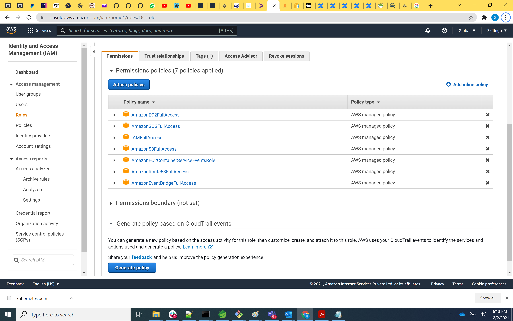
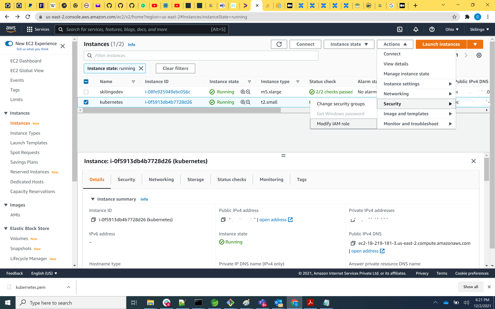
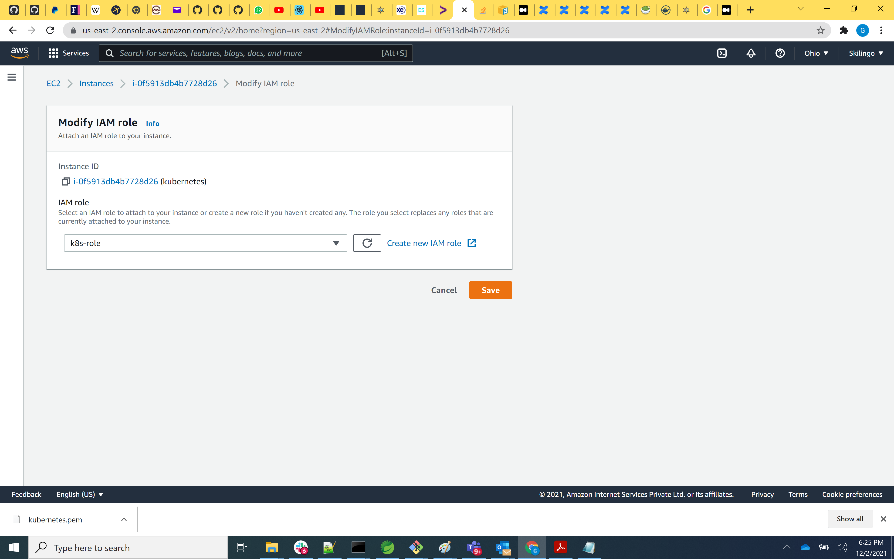

#  Create Kubernetes cluster in aws ec2 using kops 

## 1) Create  a new Ubuntu 20 ec2 instance 

 We need this instance to configure aws cli and kops and create cluster from this machine .

min 2 GB is required , so can't use free tire .. 


## 2) Install aws cli

logon to the ec2 instance and install aws cli
 
```

sudo curl "https://awscli.amazonaws.com/awscli-exe-linux-x86_64.zip" -o "awscliv2.zip"

sudo apt install unzip

sudo unzip awscliv2.zip

sudo ./aws/install

aws --version

```
**o/p: 
aws-cli/2.4.5 Python/3.8.8 Linux/5.11.0-1020-aws exe/x86_64.ubuntu.20 prompt/off
**

## 3) Install kubectl 
Kubectl is the tool through which we will call kubernetes api's

```

curl -LO https://storage.googleapis.com/kubernetes-release/release/$(curl -s https://storage.googleapis.com/kubernetes-release/release/stable.txt)/bin/linux/amd64/kubectl
 chmod +x ./kubectl
 sudo mv ./kubectl /usr/local/bin/kubectl
 
```

## 4) Create an IAM role with the following full access  

See the screen shot below 



## 5) Apply the role to ec2 instance 

	   Select the ec2 instance and go to actions , instance settings , Modify IAM role
	   
	   
	   
	   In this screen choose the role what we had created in step 4 . I had created ks8-role and i attached it with this ec2 machine 
     
	 

## 6) configure aws 
  
  ```
  
  aws configure
  
  ```
  Do not provide accesskey, secret key , default region enter the region in which we created the ec2 instance 
  I am using us-east-2 
  Do not enter anything in default output format 
  
## 7) Install kops on ubuntu instance

```

curl -LO https://github.com/kubernetes/kops/releases/download/$(curl -s https://api.github.com/repos/kubernetes/kops/releases/latest | grep tag_name | cut -d '"' -f 4)/kops-linux-amd64
 chmod +x kops-linux-amd64
 sudo mv kops-linux-amd64 /usr/local/bin/kops

```
check kops installed ? 

just type KOPS in gitbash UI 

## 8) Create a Route53 private hosted zone (you can create Public hosted zone if you have a domain)

    Go to Route53 and create a private zone and attach the vpc which is created for the zone(us-east-2)


steps :
Goto ROUTE53 -> create hosted zone 
domain name:k8s.dev.minbridges.in
private hosted zone
us ease -2 -> select vpc id (default VPC) hint : Use the same region used to create EC2 instance 


## 9) Create S3 bucket 

```
Why S3 bucket creation required ?
	- KOPS will generate cluster configuration , to store it need S3 


aws s3 mb s3://dev.k8s.mindbridges.in  {ie., name for s3 bucket can be anything}

export KOPS_STATE_STORE=s3://dev.k8s.mindbridges.in

```

## 10) Create sshkeys before creating cluster

ssh-keygen

will ask for file, passphrase do not enter any info .. just click enter button 


## 11) Create kubernetes cluster definitions on S3 bucket

```

kops create cluster --cloud=aws --zones=us-east-2b --name=dev.k8s.mindbridges.in --dns-zone=dev.k8s.mindbridges.in --dns private

```

## 12) Create Kubernetes Cluster 

```

kops update cluster dev.k8s.mindbridges.in --yes --admin

o/p :-
2 EC2 instance will get create : 1 master + 1 worker 
default EC2 instance type : t3.medium 

4 GB RAM min for Master node
2 GB RAM min for worker node

```

## 13) Validate the cluster 


```

kops validate cluster --wait 10m

```

## 14) List Nodes 

```

kubectl get nodes

o/p :
2 EC2 created list details will be listed ....

```

## 15) Add another worker node to the cluster 

```

kops edit ig nodes-us-east-2b (format is nodes-<put your availability Zone in which master and worker is deployed>)     # 

**note : create a EC2 in same region where other 2 EC2 nodes are created ! 
**

```

The above command will open a yaml file in the vi editor . Please increase the maxSize and minSize to 2
Save it and execute the following command 

```

kops update cluster dev.k8s.mindbridges.in --yes    # o/p : new worker node EC2 will get created ... 

```

## 15) Deploy Nginx Container 

```

kubectl run sample-nginx --image=nginx --port=80
kubectl get pods

Deploy a java container 

kubectl run springboot --image=gaje85/hellodockerzulu --port=8080
kubectl get pods

```

## 17) Delete the cluster 

```
export KOPS_STATE_STORE=s3://dev.k8s.mindbridges.in
kops delete cluster --name=dev.k8s.mindbridges.in --yes

``` 


